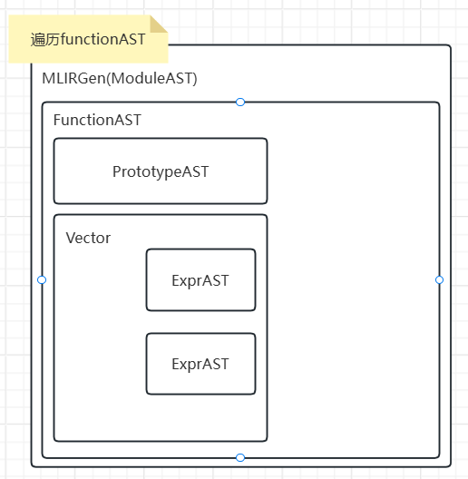

# MLIR Learning
## Set up  
运用模版构建standalone mlir项目。
```shell
mlir-tutorial
├── install       # MLIR 编译后安装到这里
├── llvm-project  # MLIR 项目
└── mlir-toy      # 自己的 MLIR 工程
```
如下方式构建mlir项目:  
> git clone git@github.com:llvm/llvm-project.git  

> cd llvm-project  
mkdir build  
cd build  

用下述build选项build项目：
```shell
cmake -DBUILD_SHARED_LIBS=On \
      -DCMAKE_BUILD_TYPE=Release\
      -DLLVM_ENABLE_LLD=On \
      -DLLVM_LINK_LLVM_DYLIB=Off \
      -DLLVM_OPTIMIZED_TABLEGEN=On \
      -DLLVM_ENABLE_PROJECTS="mlir" \
	  -DLLVM_BUILD_EXAMPLES=ON \
	  -DLLVM_TARGETS_TO_BUILD="Native;NVPTX;AMDGPU" \
	  -DCMAKE_INSTALL_PREFIX=/home/leon/tutorial/mlir-tutorial/install \
      -G Ninja \
      ../llvm
```
* project支持mlir和clang。
* 后端支持标准的X86等成熟后端以及amdgpu。
* 启动example选项，支持toy等例子的编译（llvm in tree教学项目）。  

查看install目录下的llvm构建内容：
``` shell
install
├── bin
├── examples
├── include
├── lib
└── share
```
> echo 'export PATH=/home/leon/tutorial/mlir-tutorial/install/bin:$PATH' >> ~/.bashrc  
source ~/.bashrc 

持久化更改，方便调用install下的bin里面的mlir-opt等程序。  

## mlir tutorial
### mlir dump
```shell
bash build.sh  
bash dump.sh
```

### mlir gen
```
bash build.sh  
bash gen.sh
```
### tblgen project 
如下是tablegen的项目结构：
```shell
ex3-dialect
├── CMakeLists.txt           # 控制其他各个部分的 CMakeList
├── include
│   └── toy
│       ├── CMakeLists.txt  # 控制 Dialect 定义的 CMakeList
│       ├── ToyDialect.h    # Dialect 头文件
│       ├── ToyDialect.td   # Dialect TableGen 文件
│       ├── ToyOps.h        # Op 头文件
│       ├── ToyOps.td       # Op TableGen 文件
│       └── Toy.td          # 把 ToyDialect.td 和 ToyOps.td include 到一起，用于 tablegen
├── lib
│   ├── CMakeLists.txt
│   └── toy.cpp             # Dialect library
└── tools
    └── toy-opt
        ├── CMakeLists.txt
        └── toy-opt.cpp     # Executable Tool
```
学习完第一个tutorial后，达到如下目标：  
1. 用cmake构建mlir standalone项目框架
2. 学会使用tablegen编写基本dialect的op语法，type语法等
3. 学会编写简单的pass
4. 学会partial lower到llvm或是其他后端  
欠缺的点：
* mlir test框架的集成
* 一个完整的编译器
* mlir技术细节

### Integration Test
> mlir的集成测试，使用lit搭配FileCheck工具。

`lit.cfg配置文件`
```python
import os
import lit.formats

# The name of the test suite.
config.name = 'Toy Dialect Tests'

# Specify the test format.
config.test_format = lit.formats.ShTest()

# Test file suffixes
config.suffixes = ['.toy']
config.suffixes = ['.mlir']
config.excludes = ['lit.cfg.py']

# Ensure the tools directory is correctly set
config.dlyc_executable = '/home/leon/tutorial/mlir-tutorial/mlir-toy/build/bin/dlyc'

# Path configuration for test sources
config.test_source_root = os.path.dirname(__file__)
config.test_exec_root = os.path.join(config.test_source_root, 'toy')

# Add necessary environment variables, if any
config.environment['PATH'] = os.path.dirname(config.dlyc_executable) + os.pathsep + os.environ['PATH']
```
`codegen.toy测试示例`
```python
# RUN: dlyc %s -emit=mlir > %t.out 2>&1
# RUN: FileCheck-10 %s < %t.out

# User defined generic function that operates on unknown shaped arguments
def multiply_transpose(a, b) {
  return transpose(a) * transpose(b);
}

def main() {
  var a<2, 3> = [[1, 2, 3], [4, 5, 6]];
  var b<2, 3> = [1, 2, 3, 4, 5, 6];
  var c = multiply_transpose(a, b);
  var d = multiply_transpose(b, a);
  print(d);
}

# CHECK-LABEL: dly.func private @multiply_transpose(
# CHECK-SAME:                           [[VAL_0:%.*]]: tensor<*xf64>, [[VAL_1:%.*]]: tensor<*xf64>) -> tensor<*xf64>
# CHECK:         [[VAL_2:%.*]] = dly.transpose([[VAL_0]] : tensor<*xf64>) to tensor<*xf64>
# CHECK-NEXT:    [[VAL_3:%.*]] = dly.transpose([[VAL_1]] : tensor<*xf64>) to tensor<*xf64>
# CHECK-NEXT:    [[VAL_4:%.*]] = dly.mul [[VAL_2]], [[VAL_3]] :  tensor<*xf64>
# CHECK-NEXT:    dly.return [[VAL_4]] : tensor<*xf64>

# CHECK-LABEL: dly.func @main()
# CHECK-NEXT:    [[VAL_5:%.*]] = dly.constant dense<{{\[\[}}1.000000e+00, 2.000000e+00, 3.000000e+00], [4.000000e+00, 5.000000e+00, 6.000000e+00]]> : tensor<2x3xf64>
# CHECK-NEXT:    [[VAL_6:%.*]] = dly.reshape([[VAL_5]] : tensor<2x3xf64>) to tensor<2x3xf64>
# CHECK-NEXT:    [[VAL_7:%.*]] = dly.constant dense<[1.000000e+00, 2.000000e+00, 3.000000e+00, 4.000000e+00, 5.000000e+00, 6.000000e+00]> : tensor<6xf64>
# CHECK-NEXT:    [[VAL_8:%.*]] = dly.reshape([[VAL_7]] : tensor<6xf64>) to tensor<2x3xf64>
# CHECK-NEXT:    [[VAL_9:%.*]] = dly.generic_call @multiply_transpose([[VAL_6]], [[VAL_8]]) : (tensor<2x3xf64>, tensor<2x3xf64>) -> tensor<*xf64>
# CHECK-NEXT:    [[VAL_10:%.*]] = dly.generic_call @multiply_transpose([[VAL_8]], [[VAL_6]]) : (tensor<2x3xf64>, tensor<2x3xf64>) -> tensor<*xf64>
# CHECK-NEXT:    dly.print [[VAL_10]] : tensor<*xf64>
# CHECK-NEXT:    dly.return
```
#### 将lit测试集成到项目中
`CMake修改`  
在顶层CMakeLists.txt文件，添加如下语句：
```cmake
enable_testing()

# 配置 lit 测试
find_program(LIT_EXECUTABLE NAMES lit)

if (LIT_EXECUTABLE)
    # 添加测试目录
    set(TEST_SOURCES ${CMAKE_SOURCE_DIR}/test/toy)

    # 添加 lit 测试
    add_custom_target(
        run_lit_tests
        COMMAND ${LIT_EXECUTABLE} ${TEST_SOURCES}
        WORKING_DIRECTORY ${CMAKE_BINARY_DIR}
        COMMENT "Running lit tests"
    )

    # 将 lit 测试添加到 CTest 测试
    add_test(NAME lit_tests COMMAND ${LIT_EXECUTABLE} ${TEST_SOURCES})
else ()
    message(FATAL_ERROR "lit not found, please install it.")
endif ()
```

## mlir toy项目
> MLIR官方文档有许多tutorial，学习toy这个教学语言，理解mlir的整体流程开发。基于mlir的基础框架，编写standalone的dly dialect，完成dly-opt工具。


### Toy Parser + MLIRGen
> Lexer + Parser + MLIRGen对于toy compiler而言，是前端，其作用是先词法分析`.toy`文件（`.mlir`文件不用这整个步骤），然后语法分析出AST，再基于AST转换成MLIR IR形式。

* Lexer：手写的最基本的lexer，toy language默认按照空格划分，比c lexer简单
* Parser：手写递归下降，生成AST树（std::unique_ptr<>树状结构）。
* MLIRGen：代码生成MLIR ir形式代码。

#### 入口函数
```cpp
// Handle '.toy' input to the compiler.
if (inputType != InputType::MLIR &&!llvm::StringRef(inputFilename).ends_with(".mlir")) {
  auto moduleAST = parseInputFile(inputFilename);
  if (!moduleAST)
    return 6;
  module = mlirGen(context, *moduleAST);
  return !module ? 1 : 0;
}
```
上述是针对`.toy`文件的parse+codegen过程。`parseInputFile`是LEXER+PARSER。`mlirGen`是代码生成部分。对于前端感兴趣，可以阅读这两个函数的具体实现。
```cpp
// Otherwise, the input is '.mlir'.
llvm::ErrorOr<std::unique_ptr<llvm::MemoryBuffer>> fileOrErr = llvm::MemoryBuffer::getFileOrSTDIN(inputFilename);
if (std::error_code ec = fileOrErr.getError()) {
  llvm::errs() << "Could not open input file: " << ec.message() << "\n";
  return -1;
}

// Parse the input mlir.
llvm::SourceMgr sourceMgr;
sourceMgr.AddNewSourceBuffer(std::move(*fileOrErr), llvm::SMLoc());
module = mlir::parseSourceFile<mlir::ModuleOp>(sourceMgr, &context);
if (!module) {
  llvm::errs() << "Error can't load file " << inputFilename << "\n";
  return 3;
}
return 0;
```
这是针对`mlir ir`文件的操作，是mlir处理IR并生成MLIR module的标准化操作。对于`SourceMgr`等，为llvm处理文本的封装结构。

#### MLIR Gen
> 这是前端的重点部分，涉及使用mlir提供的builder类来构造mlir module结构。后续无论是pass，transform还是lowering操作，要想复用mlir提供的构件，均需要基于mlir的**moduleOp**这个结构。简单的builder sample可以看`gen.cpp`文件，该文件涉及如何生成一个10位数组sum add操作的mlir ir表示。    

mlirgen中，`class MLIRGen`是interface class，而真正的实现是`MLIRGenImpl`。重点关注于`MLIRGenImpl`类的实现：
```cpp
/// A "module" matches a Toy source file: containing a list of functions.
mlir::ModuleOp theModule;

/// The builder is a helper class to create IR inside a function. The builder
/// is stateful, in particular it keeps an "insertion point": this is where
/// the next operations will be introduced.
mlir::OpBuilder builder;

/// The symbol table maps a variable name to a value in the current scope.
/// Entering a function creates a new scope, and the function arguments are
/// added to the mapping. When the processing of a function is terminated, the
/// scope is destroyed and the mappings created in this scope are dropped.
llvm::ScopedHashTable<StringRef, mlir::Value> symbolTable;
```
上述是`MLIRGenImpl`类的private属性。实现了：（1）一个OpBuilder来辅助生成IR structure，其中，OpBuilder本质是状态机，可以更改insertionPoint的位置。（2）moduleOp是整个IR的最外层，可以参考https://mlir.llvm.org/docs/Tutorials/UnderstandingTheIRStructure/.

为了理解OpBuilder的工作原理，仔细阅读源码即可。

MLIRGen有一个关键点：`builder.create<MulOp>(location, lhs, rhs)`中的MulOp操作。这个操作可以使MLIR自带Dialect中定义的，也可以是自行定义的。本project定义一个dly dialect。具体How to write a Dialect参见下一章。

### Dialect+Operation
> 这部分重点完成：如何利用ODS工具，编写Dialect和Operation代码。理解tablegen工具自动生成的cpp文件。学会利用cmake组织ODS工具代码。


### MLIR Pass + PatternRewrite + Interface
> 官方tutorial介绍了两种pass的编写方式。一种是针对于特定operation的pass，另一种是基于通用pass interface的pass编写。

* 针对于特定Operation的优化：
  transposeOp(transposeOp)
* 基于PassInterface的优化：  inline -> shapeInference -> 运用Canonicalize Pass，DCE Pass等，构成pass pipeline

#### PatternRewrite
两种PatternRewrite的方法：  
1. c++代码编写
2. DDR 模版编写

`transpose(transpose(x))`优化：lib/dly/DlyCombine.cpp中，**重点是需要注册Canonicalization framework！**
```cpp
/// write a single rewrite pattern to handle transpose(transpose(x)) -> x
struct SimplifyRedundantTranspose : public mlir::OpRewritePattern<TransposeOp> {
    /// We register this pattern to match every toy.transpose in the IR.
    /// The "benefit" is used by the framework to order the patterns and process
    /// them in order of profitability.
    SimplifyRedundantTranspose(mlir::MLIRContext *context) : OpRewritePattern<TransposeOp>(context, /*benefit=*/1) {}

    /// This method is attempting to match a pattern and rewrite it. The rewriter
    /// argument is the orchestrator of the sequence of rewrites. It is expected
    /// to interact with it to perform any changes to the IR from here.
    mlir::LogicalResult matchAndRewrite(TransposeOp op, mlir::PatternRewriter &rewriter) const override {
        // Look through the input of the current transpose.
        mlir::Value transposeInput = op.getOperand();
        // Check if the input is also a transpose.
        // use getDefiningOp() to get the defining operation of the value.
        TransposeOp transposeInputOp = transposeInput.getDefiningOp<TransposeOp>();

        // Input defined by another transpose? If not, no match.
        if (!transposeInputOp)
            return failure();

        // Otherwise, we have a redundant transpose. Replace it by the input of
        // the current transpose operation.
        rewriter.replaceOp(op, {transposeInputOp.getOperand()});
        return success();
    }
};
```
注册的写法：
```cpp
/// Register out patterns for rewrite by the Canonicalization framework.
void TransposeOp::getCanonicalizationPatterns(RewritePatternSet &results, MLIRContext *context) {
    results.add<SimplifyRedundantTranspose>(context);
}
```

#### Interface


### MLIR Partial Lowering + Lowering to LLVM
> 这部分是要将mlir ir lower到底层代码，体现了MLIR相比LLVM的最大优势，即multilevel。通过现将MLIR IR lower到affine dialect，保留IR中的循环结构（LLVM的做法是直接lower到LLVM的IR上，为SSA线性结构，对于LOOP的分析增加困难。**对于ML任务而言，LOOP的循环优化分析是大头，mlir的提出也是为了增加分析优化的灵活度**）。  

## References
1. https://github.com/KEKE046/mlir-tutorial(mlir tutorial部分重点参考此文档)
2. https://mlir.llvm.org/docs/Tutorials/Toy(mlir官方toy compiler教程)
3. MLIR: Multi-Level Intermediate Representation
Building a Compiler with MLIR(google talk slide)
4. https://sunfishcode.github.io/blog/2018/10/22/Canonicalization.html
5. https://mlir.llvm.org/docs/PatternRewriter/
6. https://mlir.llvm.org/docs/Interfaces/

